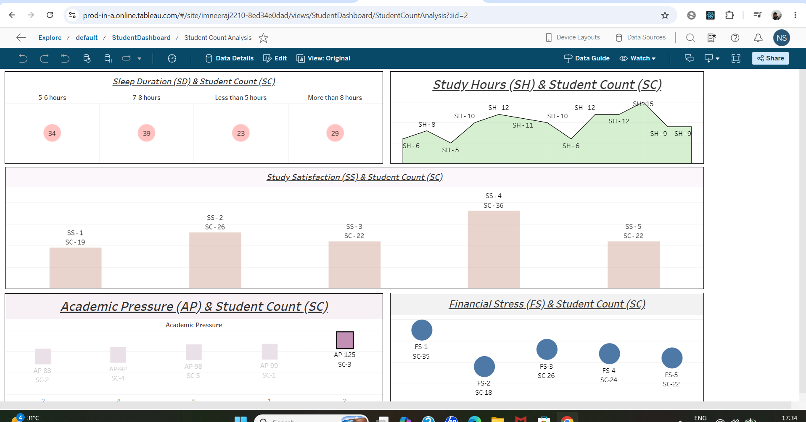

# Student Mental Health & Academic Performance Analytics

## 📊 Interactive Dashboard
👉 **(https://prod-in-a.online.tableau.com/#/site/imneeraj2210-8ed34e0dad/views/StudentDashboard/StudentCountAnalysis?:iid=2)**

---

## 📸 Preview

---

## 📌 Project Overview
An interactive Business Intelligence dashboard exploring key factors impacting student mental health, academic performance, and overall satisfaction.

### Key Metrics Analyzed:
* **Sleep Duration vs. Student Count**
* **Study Hours & Workload Distribution**
* **Study Satisfaction Levels**
* **Academic Pressure & Financial Stress Factors**

---

## 🛠️ Tech Stack & Architecture
* **Data Visualization:** Tableau Cloud / Tableau Desktop
* **ETL & Data Prep:** Tableau Prep Builder / SQL
* **Data Source:** Student Mental Health Dataset (`.csv`)
* **Storage & Sharing:** GitHub Repository & Tableau Public

---

## 📁 Repository Structure
* `StudentDashboard.twbx` — Full packaged Tableau workbook.
* `Depression+Student+Dataset.csv` — Primary dataset.
* `dashboard_preview.png` — Visual preview.
